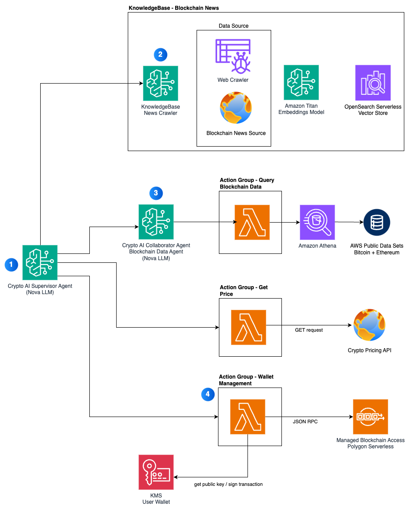

# Crypto AI Agents on Amazon Bedrock

As Web3 and generative AI technologies continue to rapidly evolve, a new category of applications known as Crypto AI Agents has emerged. These agents use large language models (LLMs) for their intelligence to accomplish a variety of blockchain-related tasks through a supervisor-collaborator architecture. A supervisor agent orchestrates specialized collaborator agents to analyze blockchain data, identify on-chain investment opportunities, and interact with both humans and other agents. These agents can be equipped with cryptocurrency wallets for autonomous transactions when opportunities arise.

Engaging with cryptocurrencies on-chain using AI agents presents several technical challenges: 
- Orchestrating multiple specialized agents for complex tasks
- Securely maintaining cryptocurrency wallets
- Integrating real-time and historical data feeds
- Accessing and analyzing current news
- Preventing hallucinations through reliable data sources
- Managing secure blockchain interactions

This repository presents a solution architecture for foundational building blocks for a Crypto AI Agent. The solution leverages several AWS services:
- [Amazon Bedrock Agents](https://aws.amazon.com/bedrock/agents/) for creating supervisor and collaborator agents
- [Amazon Bedrock Knowledge Bases](https://aws.amazon.com/bedrock/knowledge-bases/) for news aggregation 
- The [Amazon Nova](https://aws.amazon.com/ai/generative-ai/nova/) family of models for state-of-the-art language processing
- [AWS Key Management Service](https://aws.amazon.com/kms/) (AWS KMS) for secure wallet management
- [Amazon Managed Blockchain](https://aws.amazon.com/managed-blockchain/) for network access
- [Amazon OpenSearch Serverless](https://aws.amazon.com/opensearch-service/features/serverless/) for vectorized data storage

## Solution Architecture
The Crypto AI Agent is designed with the following capabilities:

•	Analyze token market data, including real-time token prices
•	Estimate gas fees for submitting transactions
•	Query on-chain wallet balances for tokens
•	Provide investment recommendations (these are simulated)
•	Submit transactions to the blockchain (send payment to another address)
•	Aggregate near real-time Web3 news and data
•	Support complex tasks through multi-agent orchestration

The following diagram illustrates the solution architecture and how the various components work together to provide the Crypto AI Agent with its capabilities.



1. The supervisor agent coordinates actions across its own action groups and other collaborator agents to fulfill user requests
2. A Bedrock knowledge base that contains current blockchain news and trends
3. A collaborator agent specializing in accessing historic bitcoin and ethereum data
4. Action group used by the supervisor agent to complete wallet related actions such as querying balances and sending transactions

## Deploy the solution

The solution is an [AWS CDK](https://aws.amazon.com/cdk/) application. Follow the steps below to deploy it.

1. Clone this repository and change directory into it
```
git clone git@github.com:aws-samples/crypto-ai-agents-with-amazon-bedrock.git
cd crypto-ai-agents-with-amazon-bedrock
```

2. Prepare your environment

Copy `.env.sample` to a new `.env` file
```
cp .env.sample .env
```

Update `.env` with the appropriate values, including the AWS account ID.

The solution defaults to using Polygon mainnet and accesses it via Amazon Managed Blockchain. If you want to use a different EVM-compatible network, specify the RPC endpoint in the `BLOCKCHAIN_RPC_URL` variable in the `.env`.

(Optional) If you want your agent to query current cryptocurrency prices, you will need to obtain a [CoinGecko API key](https://www.coingecko.com/en/developers/dashboard)

3. Install dependencies
```
npm install
```

4. Deploy the CDK application
Install CDK locally.
```
npm install -g aws-cdk
```

If you have not done so in this account before, you will need to bootstrap your account for CDK before deploying the application.
```
cdk bootstrap aws://${CDK_DEPLOY_ACCOUNT}/${CDK_DEPLOY_REGION}
```

There are several CDK stacks to deploy, and you can deploy all of them at once by running:
```
cdk deploy --all --require-approval never
```

The deployment time is about 10 minutes.

5. Enable Bedrock Model Access

The model uses the Amazon Nova Lite v1 model and you need to enable access to this model before your agent can use it.

- Open [Model access from the Bedrock console](https://us-east-1.console.aws.amazon.com/bedrock/home?region=us-east-1#/modelaccess).
- Click `Modify model access`
- Search for `Nova`. Select Amazon Nova Lite. Click `Next`, then `Submit`.

**Orchestrating the two agents together**

The solution deploys two agents; a Supervisor Agent (Crypto AI Agent) which coordinates the user requests across various tasks, and a Collaborator Agent (Blockchain Data Agent) which fulfills a specific need of accessing historic blockchain data. We want our users to only have to send their queries to the Supervisor Agent, instead of needing to switch between agents. Therefore, any time a user wants to query historic blockchain data, we need our Supervisor Agent to delegate this request to the Collaborator Agent. The steps below guide you on how to do this.

1. From supervisor agent, enable multi-agent collaboration
2. Under Collaboration configuration, select `Supervisor`
3. Select the blockchain data agent as the collaborator, and select a version
4. Set the collaborator name to `blockchain-data-collaborator-agent`
5. Set the Collaborator instruction to `The blockchain-data-collaborator-agent can query historic bitcoin and ethereum data, providing data such as number of transactions within a period of time, details of a block, or how many times a token was a transferred within a period of time.`
6. Click 'Save and exit'. Click `Prepare` to prepare a new version of the agent.

### Testing

Test out the agent with these prompts:
- How many bitcoin transactions were there yesterday?
- What is your wallet address?
- Send .00001 POL to x.polygon
- What is the latest news on bitcoin?

### Troubleshooting Deployment Issues

#### Python Dependencies Error
If you encounter an error during deployment related to Python dependencies bundling, ensure Docker is running on your machine

## Security

See [CONTRIBUTING](CONTRIBUTING.md#security-issue-notifications) for more information.

## License

This library is licensed under the MIT-0 License. See the LICENSE file.