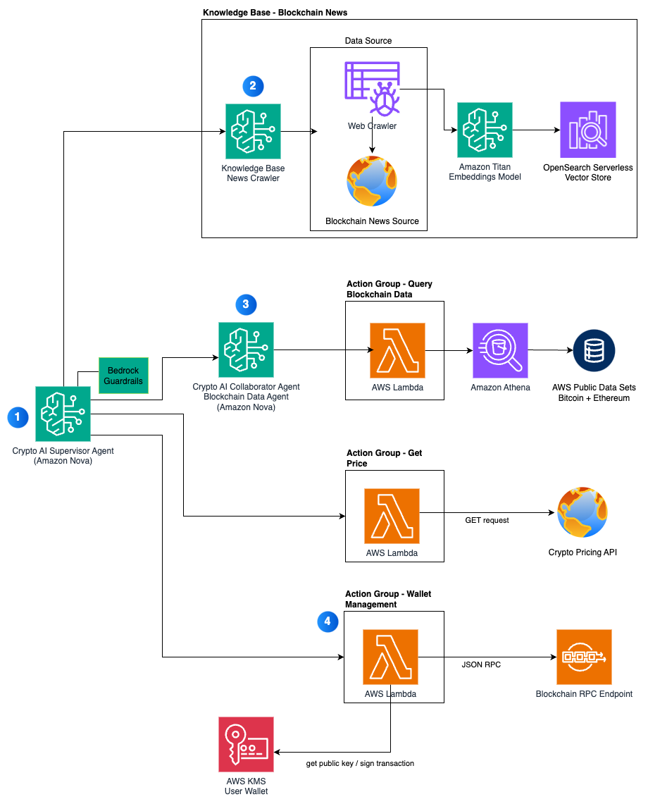
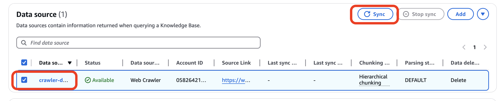

# Crypto AI Agents on Amazon Bedrock

As Web3 and generative AI technologies continue to rapidly evolve, a new category of applications known as Crypto AI Agents has emerged. These agents use large language models (LLMs) for their intelligence to accomplish a variety of blockchain-related tasks through a supervisor-collaborator architecture. A supervisor agent orchestrates specialized collaborator agents to analyze blockchain data, identify on-chain investment opportunities, and interact with both humans and other agents. These agents can be equipped with cryptocurrency wallets for autonomous transactions when opportunities arise.

Engaging with cryptocurrencies on-chain using AI agents presents several technical challenges: 
- Orchestrating multiple specialized agents for complex tasks
- Securely maintaining cryptocurrency wallets
- Integrating real-time and historical data feeds
- Accessing and analyzing current news
- Preventing hallucinations through reliable data sources
- Managing secure blockchain interactions

This repository presents a solution architecture for foundational building blocks for a Crypto AI Agent. The solution leverages several AWS services:
- [Amazon Bedrock Agents](https://aws.amazon.com/bedrock/agents/) for creating supervisor and collaborator agents
- [Amazon Bedrock Knowledge Bases](https://aws.amazon.com/bedrock/knowledge-bases/) for news aggregation 
- The [Amazon Nova](https://aws.amazon.com/ai/generative-ai/nova/) family of models for state-of-the-art language processing
- [AWS Key Management Service](https://aws.amazon.com/kms/) (AWS KMS) for secure wallet management
- [Amazon Managed Blockchain](https://aws.amazon.com/managed-blockchain/) for network access
- [Amazon OpenSearch Serverless](https://aws.amazon.com/opensearch-service/features/serverless/) for vectorized data storage

## Solution Architecture
The Crypto AI Agent is designed with the following capabilities:

- Analyze token market data, including real-time token prices
- Estimate gas fees for submitting transactions
- Query on-chain wallet balances for tokens
- Provide investment recommendations (these are simulated)
- Submit transactions to the blockchain (send payment to another address)
- Aggregate near real-time Web3 news and data
- Support complex tasks through multi-agent orchestration

The following diagram illustrates the solution architecture and how the various components work together to provide the Crypto AI Agent with its capabilities.



1. The supervisor agent coordinates actions across its own action groups and other collaborator agents to fulfill user requests
2. A Bedrock knowledge base that contains current blockchain news and trends
3. A collaborator agent specializing in accessing historic blockchain data
4. Action group used by the supervisor agent to complete wallet related actions such as querying balances and sending transactions

## Deploy the solution

The solution is an [AWS CDK](https://aws.amazon.com/cdk/) application. You can deploy it either directly or using Docker. You will need to have [Docker](https://www.docker.com/) running for both methods.

### Option 1: Standard Deployment

1. Clone this repository and change directory into it
```bash
git clone git@github.com:aws-samples/crypto-ai-agents-with-amazon-bedrock.git
cd crypto-ai-agents-with-amazon-bedrock
```

2. Prepare your environment

Copy `.env.sample` to a new `.env` file
```bash
cp .env.sample .env
```

Update `.env` with the appropriate values, including the AWS `ACCOUNT_ID`.

The solution defaults to using Polygon mainnet and accesses it via Amazon Managed Blockchain. If you want to use a different EVM-compatible network, specify the RPC endpoint in the `BLOCKCHAIN_RPC_URL` variable in the `.env`.

(Optional) If you want your agent to query current cryptocurrency prices, you will need to obtain a [CoinGecko API key](https://www.coingecko.com/en/developers/dashboard)

(Optional) The agent understands Ethereum Name Service (ENS) domain names, for example, translating `vitalik.eth` into the corresponding address. If you use the default Polygon network, this will work without any changes required. However, if you are using a different network, and want to have the agent support domain name resolution. you will need to set the Unstoppable Domains contract address in the `UNSTOPPABLE_DOMAINS_ADDRESS` variable. 

3. Install dependencies
```bash
npm install
```

4. Deploy the CDK application
Install CDK locally.
```bash
npm install -g aws-cdk
```

If you have not done so in this account before, you will need to bootstrap your account for CDK before deploying the application.
```bash
cdk bootstrap aws://${CDK_DEPLOY_ACCOUNT}/${CDK_DEPLOY_REGION}
```

There are several CDK stacks to deploy, and you can deploy all of them at once by running:
```bash
cdk deploy --all --require-approval never
```

The deployment time is about 10 minutes.

### Option 2: Deployment Using Docker (Recommended)

This method provides a more controlled environment with fewer dependency issues.

1. Clone this repository and change directory into it
```bash
git clone git@github.com:aws-samples/crypto-ai-agents-with-amazon-bedrock.git
cd crypto-ai-agents-with-amazon-bedrock
```

2. Make the deployment scripts executable
```bash
chmod +x docker-setup.sh fix-lambda-layers.sh deploy.sh
```

3. Run the setup script to initialize your environment
```bash
./docker-setup.sh
```

4. Edit the `.env` file with your AWS account details
```bash
# Required
ACCOUNT_ID=<your-aws-account-id>

# Optional
COINGECKO_API_KEY=<your-coingecko-api-key>
```

5. Run the deployment script
```bash
./deploy.sh
```

This script will:
- Check that Docker is running
- Verify AWS credentials are configured
- Fix any dependency issues
- Deploy all the CDK stacks with retry logic

The deployment script includes advanced error handling and will automatically fix common deployment issues.

### Option 3: Running in an Existing Docker Container

If you're already using Docker:

```bash
# Build and start the container
docker-compose up -d

# Access the running container
docker-compose exec crypto-ai-agent bash

# Inside the container, run the deployment
./deploy.sh
```

See [DOCKER_README.md](DOCKER_README.md) for more details on Docker deployment.

## Post-Deployment Configuration

After deployment, you'll need to configure a few AWS services:

### 1. Enable Bedrock Model Access

The model uses the `Amazon Nova Pro v1` model for inference and `Amazon Titan` model for creating vector embeddings for the Knowledge Base. You need to enable access to these models before they can be used.

- Open [Model access from the Bedrock console](https://us-east-1.console.aws.amazon.com/bedrock/home?region=us-east-1#/modelaccess).
- Click `Modify model access` or if this is your first time doing this, click `Enable specific models`.
- Search for `Nova`. Select `Nova Pro`.
- Clear the search.
- Search for `Titan`. Select `Titan Embeddings G1 - Textv1.2`.
- Click `Next`. Click `Submit`.

### 2. Orchestrate the Two Agents

The solution deploys two agents; a Supervisor Agent (Crypto AI Agent) which coordinates the user requests across various tasks, and a Collaborator Agent (Blockchain Data Agent) which fulfills a specific need of accessing historic blockchain data. We want our users to only have to send their queries to the Supervisor Agent, instead of needing to switch between agents. Therefore, any time a user wants to query historic blockchain data, we need our Supervisor Agent to delegate this request to the Collaborator Agent. The steps below guide you on how to do this.

1. Open the [Bedrock Agents console](https://us-east-1.console.aws.amazon.com/bedrock/home?region=us-east-1#/agents)
2. Double-click the `CryptoAI_Supervisor_Agent` agent
3. Scroll down and enable multi-agent collaboration
4. Under Collaboration configuration, select `Supervisor`
5. Select the blockchain data agent as the collaborator, and select a version
6. Set the collaborator name to `blockchain-data-collaborator-agent`
7. Set the Collaborator instruction to `The blockchain-data-collaborator-agent can query historic bitcoin and ethereum data, providing data such as number of transactions within a period of time, details of a block, or how many times a token was a transferred within a period of time.`
8. Click 'Save and exit'. Click `Prepare` to prepare a new version of the agent.

### 3. Sync the Knowledge Base

The KnowledgeBase needs to be manually synced. You can do this from the [Knowledge Bases console](https://us-east-1.console.aws.amazon.com/bedrock/home?region=us-east-1#/knowledge-bases).



1. Find and double-click the Knowledge Base named `KBInfraStacke2eRAG...`
2. On the details page, select the Data Source named `crawler-ds-kbinfra...`, and click `Sync`.

This can take up to an hour or more to sync, but you can continue testing below.

## Usage

### Testing the Agent

Test out the agent from the [Bedrock Agents console](https://us-east-1.console.aws.amazon.com/bedrock/home?region=us-east-1#/agents).

1. Double-click the `CryptoAI_Supervisor_Agent` agent
2. Use the `Test` panel on the right to try out prompts.

### Example Prompts

Here are some prompts you can try out:

- **Query Blockchain Data**: *How many bitcoin transactions were there yesterday?* (showcases multi-agent orchestration)
- **Wallet Operations**: 
  - *What is your wallet address?*
  - *Send .00001 POL to x.polygon*
  - *What is your wallet balance of POL?*
- **Market Research**: *What is the latest cryptocurrency news* (showcases querying the Knowledge Base)
- **Advanced Queries**:
  - *Which cryptocurrencies have had the highest trading volume in the last 24 hours?*
  - *What are some indicators that BTC might be entering a bullish phase?*
  - *Compare ETH and SOL price movements this month*

### Usage Tips

- Be specific with your queries to get more accurate responses
- For financial transactions, always specify the amount and recipient clearly
- For historical data, specify the time period you're interested in
- You can ask for explanations if the agent's response isn't clear

## Troubleshooting

### Deployment Issues

For detailed solutions to common deployment problems, see [DEPLOYMENT_TROUBLESHOOTING.md](DEPLOYMENT_TROUBLESHOOTING.md).

#### Common Issues:

1. **Python Dependencies Error**: If encountering errors with Python dependencies, use the fix-lambda-layers.sh script:
   ```bash
   ./fix-lambda-layers.sh
   ```

2. **Docker Connection Issues**: Ensure Docker is running on your machine.

3. **AWS Credentials**: Verify your AWS credentials are properly configured:
   ```bash
   aws sts get-caller-identity
   ```

4. **Poetry Installation Timeout**: Use the deploy.sh script which includes retry logic:
   ```bash
   ./deploy.sh
   ```

### Agent Issues

If the agent is not responding correctly:

1. Verify the models are enabled in Bedrock
2. Check that the agent collaboration is configured correctly
3. Ensure the Knowledge Base is synced
4. Try redeploying the agent via the Bedrock console

## Security

See [CONTRIBUTING](CONTRIBUTING.md#security-issue-notifications) for more information.

## License

This library is licensed under the MIT-0 License. See the LICENSE file. 